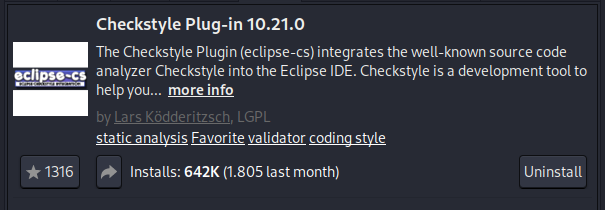
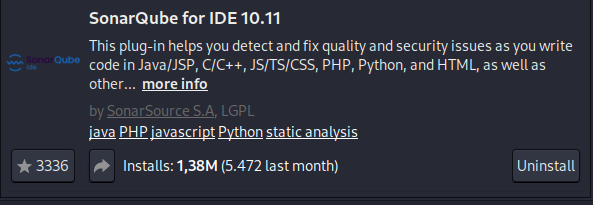
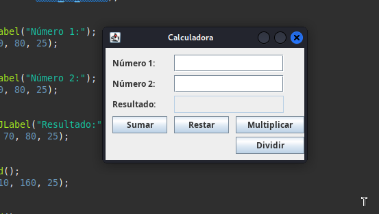
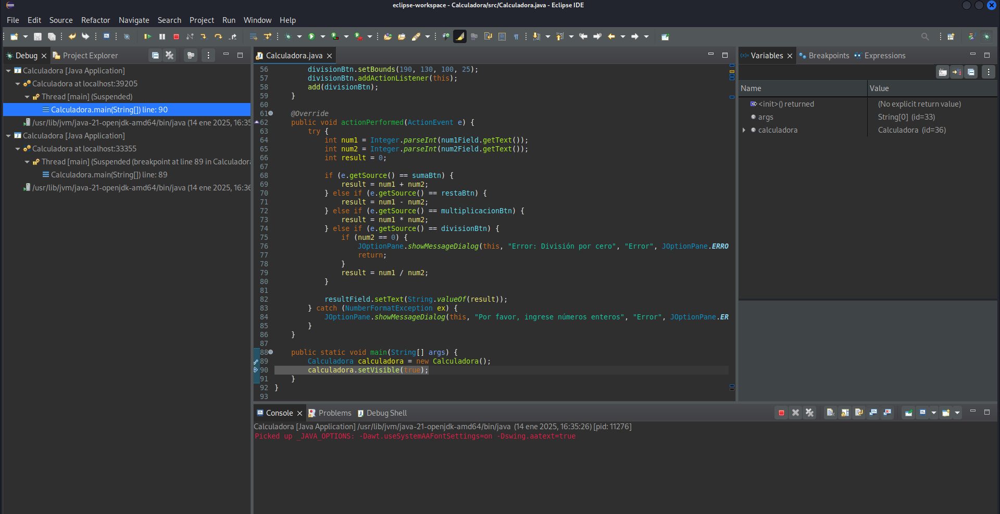

# PPS-Unidad1Actividad1-Aaron

## Instalar extensiones

Sonar: es una extensión que ayuda al desarrollador a tener un código de mejor calidad.
Checkstyle: ayuda al desarrollador a seguir unos estándares en java.

He instalado desde el marketplace de eclipse la extensión de sonar y la extensión de checkstyle.

## Prueba de entornos

He ejecutado y compilado el código de una calculadora.

Debbug:

